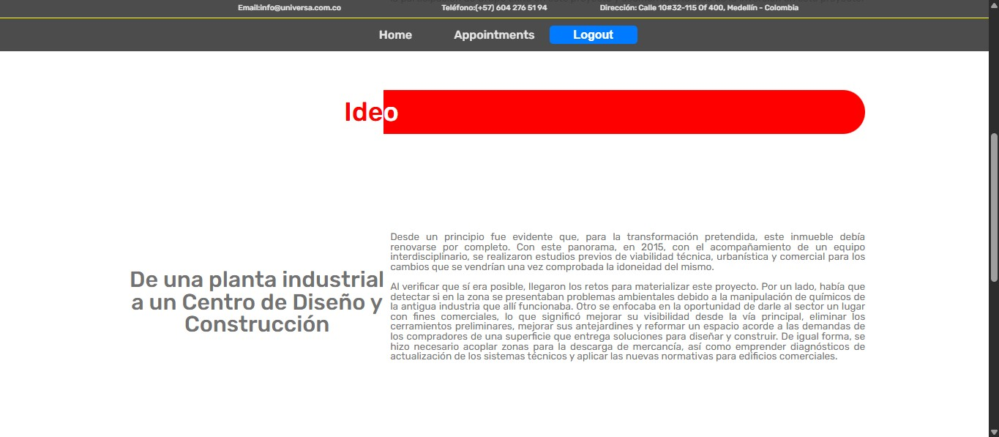
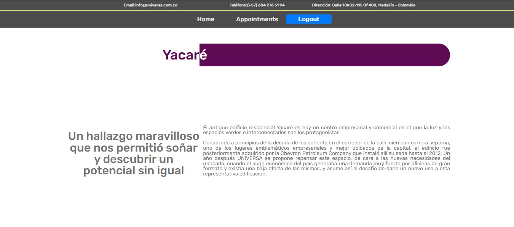
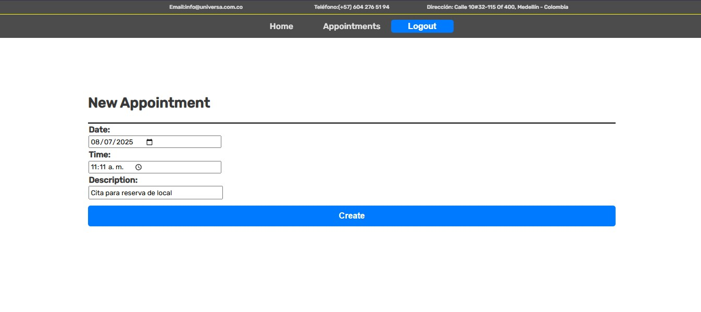
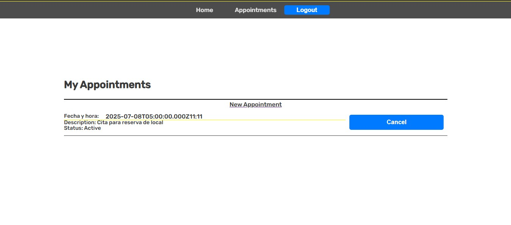

# 📅 Generador de Turnos - Universa Inversiones Inmobiliarias

Bienvenido al sistema de generación de turnos desarrollado para **Universa Inversiones Inmobiliarias**.  
Este proyecto permite organizar y gestionar turnos de manera eficiente a través de una interfaz moderna y amigable.

<p align="center">
  
</p>

<p align="center">
  
</p>

<p align="center">
  
</p>

---

## 🏢 ¿De qué trata este proyecto?

Este sistema fue diseñado para **gestionar el agendamiento de turnos** de forma ordenada y automatizada.  
Incluye una **landing page** que presenta la historia de nuestros activos y da la bienvenida a los usuarios.  
Desde allí, los visitantes pueden **registrarse, iniciar sesión y acceder a sus citas programadas**.

---

## ✨ Características principales

- 🏠 Landing page institucional con historia de los activos.
- 👤 Registro y login de usuarios.
- 📅 Generación automática de turnos.
- 🧠 Backend robusto y modular con control de errores.
- 📊 Interfaz clara y centrada en la experiencia de usuario.

---

## 🛠️ Tecnologías utilizadas

- **Frontend:**
  - Vite
  - React
  - TypeScript
  - Tailwind CSS

- **Backend:**
  - Node.js
  - Express / NestJS (según tu stack real)
  - PostgreSQL
  - TypeORM

---

## 📸 Capturas de pantalla

<p align="center">
  
  
</p>

---

## 🚀 ¿Cómo ejecutar el proyecto?

```bash
# Clona este repositorio
git clone https://github.com/nicoguaro20/Generador_de_turnos.git

# Entra a las carpetas front y back e instala dependencias
cd front
npm install
npm run dev

cd ../back
npm install
npm run dev
